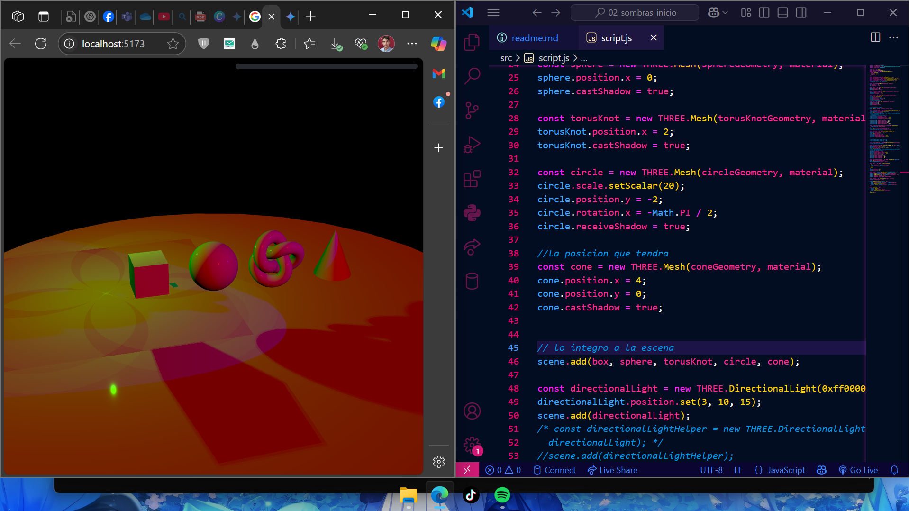

<h1 align="center">
  Escena 3D Interactiva con Three.js
</h1>
<a name="readme-top"></a>

<h4 align="center">
  Demostración de una escena 3D básica utilizando Three.js y Tweakpane.<br>
  Desarrollada en JavaScript.
</h4>


####  Para Fines Educativos y Demostración


<h2 align="center">Descripción del Proyecto</h2>

<p align="center">
  Este proyecto es una demostración de una escena 3D creada con la biblioteca Three.js. Muestra varios objetos geométricos (caja, esfera, nudo toro, círculo como suelo y un cono) con un material estándar. La escena incluye múltiples fuentes de luz (direccional, puntual y foco) que proyectan sombras, y controles de órbita para que el usuario pueda navegar e interactuar con la vista. Se utiliza Tweakpane para proporcionar una interfaz gráfica simple que podría usarse para ajustar parámetros de la escena en tiempo real (aunque en el código actual, Tweakpane se inicializa pero no se usa activamente para controlar elementos).
</p>

<p align="center">
  
</p>

<h3 align="center">Creado por:</h3>
<p align="center">
  <a href="https://github.com/gabiru05">Gabriel Ruiz (gabiru05)</a>
</p>


<h2 align="center">Características Principales</h2>

<ul>
  <li> Múltiples objetos 3D (Caja, Esfera, Nudo Toro, Cono, Círculo como suelo).</li>
  <li> Material estándar aplicado a los objetos.</li>
  <li> Iluminación diversa: Luz Direccional, Luz Puntual y Foco.</li>
  <li> Sombras dinámicas proyectadas por los objetos y las luces.</li>
  <li> Controles de Órbita (OrbitControls) para navegación interactiva.</li>
  <li> Uso de Tweakpane para una posible interfaz de depuración (inicializado).</li>
  <li> Diseño responsivo al tamaño de la ventana del navegador.</li>
  <li> Renderizado con anti-aliasing para bordes más suaves.</li>
</ul>


<h2 align="center">Estructura del Proyecto</h2>

<p align="center">
  Este proyecto generalmente consiste en un archivo HTML principal y un archivo JavaScript:
</p>

-   `index.html` (o similar): Contiene la estructura básica de la página web, incluyendo el elemento `<canvas class="threejs">` donde se renderiza la escena de Three.js y las importaciones de las bibliotecas necesarias.
-   `main.js` (o el nombre de tu script): Contiene todo el código JavaScript de Three.js para configurar la escena, cámara, luces, objetos, renderizador y el bucle de animación.

> Para ejecutar el proyecto, simplemente abre el archivo `index.html` en un navegador web moderno. Si estás utilizando módulos ES6 (`import`), es posible que necesites servir los archivos a través de un servidor local simple (por ejemplo, usando la extensión "Live Server" en VS Code o ejecutando `npx vite` si tienes un entorno de desarrollo con Vite).


<h2 align="center">Tecnologías Utilizadas</h2>

<ul>
  <li> <strong>Three.js:</strong> Biblioteca principal para la creación de gráficos 3D en la web.</li>
  <li> <strong>JavaScript:</strong> Lenguaje de programación para la lógica de la aplicación.</li>
  <li> <strong>HTML5:</strong> Para la estructura de la página web.</li>
  <li><strong>Tweakpane:</strong> Biblioteca para crear paneles de control y depuración (inicializada).</li>
  <li><strong>Vite (Opcional):</strong> Entorno de desarrollo rápido para JavaScript moderno (si se utiliza para servir el proyecto).</li>
</ul>


<h2 align="center">Instalación y Uso</h2>

1.  **Clonar el repositorio:**
    ```bash
    git clone [https://github.com/gabiru05/2025-FISC-0607-Computacion-Grafica-y-Visual-main.git](https://github.com/gabiru05/2025-FISC-0607-Computacion-Grafica-y-Visual-main.git)
    cd 2025-FISC-0607-Computacion-Grafica-y-Visual-main
    ```
2.  **Instalar dependencias (si usas un gestor de paquetes como npm o yarn con Vite):**
    Si el proyecto está configurado con Vite (o similar), ejecuta:
    ```bash
    npm install 
    # o
    yarn install
    ```
3.  **Ejecutar el proyecto:**
    * **Si usas Vite (o similar):**
        ```bash
        npm run dev
        # o
        yarn dev
        ```
        Luego abre la URL que aparece en la consola (generalmente `http://localhost:5173`).
    * **Si es un proyecto HTML/JS simple (sin Vite):**
        Abre el archivo `index.html` directamente en tu navegador web.
        Si estás usando `import` para módulos de Three.js (como `OrbitControls` desde `three/examples/jsm/...`) y no usas Vite, necesitarás servir los archivos a través de un servidor local. Una forma fácil es usar la extensión "Live Server" en Visual Studio Code.

4.  **Interactuar:**
    * Usa el ratón para rotar la cámara (clic izquierdo y arrastrar).
    * Usa la rueda del ratón para hacer zoom.
    * Usa el clic derecho (o clic central, dependiendo de la configuración de OrbitControls) y arrastrar para hacer paneo.


<p align="right"><a href="#readme-top">Volver arriba</a></p>
